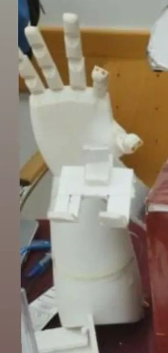

# Hand Tracking and Servo Control using OpenCV, Mediapipe, and Arduino

This project demonstrates a hand-tracking system that uses a webcam to detect hand gestures and control servos connected to an Arduino board. The project leverages Python, OpenCV, Mediapipe, and PyFirmata to create an interactive system that maps hand gestures to servo positions.



## Overview

The main purpose of this project is to track hand gestures using a webcam and control five servos connected to an Arduino board based on the detected gestures. The system recognizes the positions of the fingers and translates them into servo angles to drive the corresponding servos.

## Requirements

To run this project, you'll need the following:

- Python 3.x
- OpenCV
- Mediapipe
- PyFirmata
- Arduino with the Firmata protocol uploaded
- 5 Servos connected to the Arduino
- A webcam

## Installation

1. **Clone the repository**:
    ```bash
    git clone https://github.com/majdabualnour/bionic-hand-AI.git
    ```

2. **Install the required Python packages**:
    ```bash
    pip install opencv-python mediapipe pyfirmata
    ```

3. **Upload Firmata to your Arduino**:
    - Open the Arduino IDE.
    - Go to **File > Examples > Firmata > StandardFirmata**.
    - Upload the `StandardFirmata` sketch to your Arduino board.

## Usage

1. **Connect your Arduino**:
    - Make sure your Arduino is connected to the correct COM port (e.g., `COM5`).

2. **Run the script**:
    - Update the COM port in the `main.py` file if necessary.
    - Run the script:
    ```bash
    python main.py
    ```

3. **Control the servos**:
    - The servos will move based on the detected hand gestures from the webcam.

## How It Works

- **Hand Detection**: 
  - The script uses Mediapipe's hand tracking module to detect and track hand landmarks from the webcam feed.
  
- **Finger Detection**:
  - The tip positions of the five fingers are tracked and compared with their respective base positions to determine whether a finger is folded or extended.

- **Servo Control**:
  - The state of each finger (folded or extended) is mapped to a corresponding servo. When a finger is detected as extended, the servo moves to a predefined angle.

## Demo

Here's how the hand tracking system looks in action:


## License

This project is licensed under the MIT License - see the [LICENSE](LICENSE) file for details.

## Acknowledgments

- **Mediapipe** for providing an easy-to-use hand tracking solution.
- **OpenCV** for image processing capabilities.
- **Arduino** for enabling hardware interfacing with Python.
